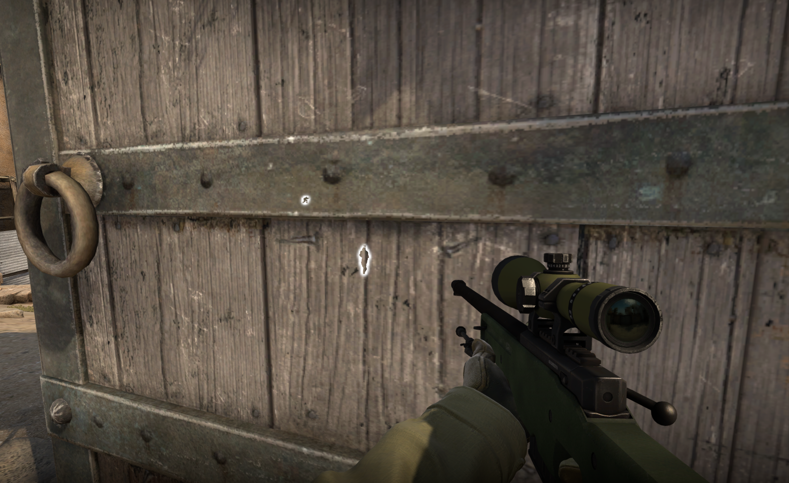

```


_____/\\\\\\\\\\\____________________________________________________________________________________________________________________/\\\\\\\\\_______________________________________         
 ___/\\\/////////\\\_______________________________________________________________________________________________________________/\\\////////________________________________________        
  __\//\\\______\///______________________________________________________________________________________________________________/\\\/________________/\\\__________/\\\_______________       
   ___\////\\\_____________/\\\\\\\\______/\\\\\\\\__/\\\____/\\\__/\\/\\\\\\\______/\\\\\\\\_____________/\\\\\\\\\\\____________/\\\_________________\/\\\_________\/\\\_______________      
    ______\////\\\________/\\\/////\\\___/\\\//////__\/\\\___\/\\\_\/\\\/////\\\___/\\\/////\\\___________\///////////____________\/\\\______________/\\\\\\\\\\\__/\\\\\\\\\\\___________     
     _________\////\\\____/\\\\\\\\\\\___/\\\_________\/\\\___\/\\\_\/\\\___\///___/\\\\\\\\\\\____________________________________\//\\\____________\/////\\\///__\/////\\\///____________    
      __/\\\______\//\\\__\//\\///////___\//\\\________\/\\\___\/\\\_\/\\\_________\//\\///////______________________________________\///\\\______________\/\\\_________\/\\\_______________   
       _\///\\\\\\\\\\\/____\//\\\\\\\\\\__\///\\\\\\\\_\//\\\\\\\\\__\/\\\__________\//\\\\\\\\\\______________________________________\////\\\\\\\\\_____\///__________\///________________  
        ___\///////////_______\//////////_____\////////___\/////////___\///____________\//////////__________________________________________\/////////________________________________________ 


                                                                                            ad8888888888ba
                                                                                           dP'         `"8b,
                                                                                           8  ,aaa,       "Y888a     ,aaaa,     ,aaa,  ,aa,
                                                                                           8  8' `8           "88baadP""""YbaaadP"""YbdP""Yb
                                                                                           8  8   8              """        """      ""    8b
                                                                                           8  8, ,8         ,aaaaaaaaaaaaaaaaaaaaaaaaddddd88P
                                                                                           8  `"""'       ,d8""
                                                                                           Yb,         ,ad8"   
                                                                                            "Y8888888888P"
```

# Article is under development 

Not much here right now, come back later :<

# About this tutorial 

This tutorial was a secondary write up i plan on doing about the C++ programming language. This tutorial will teach the basics to advanced C++ code from using simple variables to data types and using OOP concepts in C++ with the use of public private and friend classes. It will start off like any other introduction where i introduce who i am currently and what my focus of the article is then go into the basics of both security in applications and development as well as the basics of the C++ programming language, NOTE THIS TUTORIAL IS FOR C++ VERSION 20. This tutorial will teach you basic concepts of security as well as making things like encryption scripts, brute forcers, file crawlers, system loaders, authentication systems, key generators, and packet parsers and maybe even IDS's ( Intrusion Detection Systems ). 

The plan for this tutorial is to act again like any other one, it will talk about code bricks and describe them as you move on and on in the project. 


# Whoami 

my name is RE43P3R i am intermediate in cyber security, a game cheat developer, systems / security and authentication systems developer, as well as a legacy developer on my own time. I have had experience in multiple languages those which include 

Language Name  | 
-------------  | 
Fortran95      | 
Fortran77      | 
Fortran2003    |
Perl 3-5       | 
Some RAKU      | 
Ruby           | 
C++            | 
Go             | 

and others that i have yet to do write ups on, if you have not seen my other write ups i have multiple on multiple programming languages currently 

C++, Go, Perl, and general fortran and math

* C++ tutorial                              https://github.com/ArkAngeL43/Advanced-And-Secure-CXX <br>
 
* GO Basics                                 https://github.com/ArkAngeL43/Basics-Of-Go <br>

* GO Advanced Security+                     https://github.com/ArkAngeL43/Go-Cyber-Weapons-Development <br> 

* Fortran Notes                             https://github.com/ArkAngeL43/fortran-notes <br> 

* Perl Cyber weapons                        https://github.com/ArkAngeL43/Perl-basics-and-cyber-weapons-development <br>

* EXIF and Digital Forensics with images    https://github.com/ArkAngeL43/EXIF-Stegonography-and-image-injection <br> 


# Credits and reasons for this tutorial 

Recently i have just gotten a job for Authentication and systems development for a small group of people, and the code and backend of the system will be written in C++20, i have not used C++ at all in a long time which is what prompted the article, at the time of writing this i have so far spent about 4 months in the C++ programming language since a year ago and it has definitely changed alot. i want to thank the writer of the `eighth edition of C++14 and C++17 Coverage Sams teahc yourself C++ in one hour a day` despite us being in C++20 now this book has helped me alot through the proces sof writing this understanding new ways to use and write C++, the very basics of C++ but with a tad touch to it. I highly suggest if you are new to C++ you read that book, it is 700+ pages of pure amazing C++ again if your reading this adn using C++20 it might not be worth the time but it still teaches concepts used in C++.


# NOTICE 

This article is currently under development....


# Application development and a talk about security

In most of these tutorials i always have a say on security, thats because of my experience in the field of development in things such as legacy development, game cheat development, systems and auth development, and so on. Over the year or so i have been programming there is one thing i notice to actually be rare, that being security in applications especially games. The one thing i have always urged people the most during development especially when you are selling people your program or releasing it out to the public to use TO FOCUS ON SECURITY! stop wasting your time with frontend, you're main concern should be the security of an application and how it runs and its functionality. For example, right now i am working with a game called CS:GO and building cheat systems and auth systems for the game cheat application itself, this game cheat toolkit uses external tools things like player highlight and color and such. im actually going to split this talk on security into a small section about game cheating.

> What is an external cheat 

External cheats are simple, they are cheats that are not injected into the game code itself or the vulnerable DLL of the game

> What is an internal cheat 

simply internal cheats are unlike external injected into the vulnerable dll or game or executeable to make code run, with this you can mess with the games functions such as creativity, designs, hit boxes, players etc.

> How does game cheating typically happen 

game cheating is developed or happens when a hacker or developer comes across a vulnerability in the games files, and uses their programming skills to inject code into a process. For example in the game CS:Go you can get character highlight and seeing through walls and even aimbot by simply getting the games PID and memory location, taking memory values themselves for things like POS ( Position ) and injecting it into the memory. Here is an example i found online of a simple ESP (Extra sensory precision) seen below 


<p align="center">
  
</p>

most EXTERNAL cheats such as this very simple ESP is not picked up by AC ( Anti Cheat ), this is because most anti cheat systems are NOT designed to pick it up.

> How do companies and game devs fix these issues 

Typically game developers put what i like to call digital duct tape on the problem. Simply all they do is just install ANTI CHEAT systems like `VAC` to help detect if someone is cheating or not. As said above however Cheats are often not seen or picked up by anti cheat systems if they are external, which means just slapping anti cheat is the most idiotic practice you can go about when trying to fix a vulnerability. Think of that like changing your IP when someone exploits your machine and already has access, it really does not do much but hang people off for a bit until they take 3 hours to think of a better solution to better exploit that program. In this example above you saw a cheat that was external ESP that was able to bypass the VAC system that the developers of CS:GO pulled in to the game to fix an issue that will never be actually fixed. It is of the most IMPORTANT that you make sure applications especially when programming in languages like C++ are constantly CONSTANTLY updated and staying secure and if a vulnerability pops up say a 0-DAY ( A vulnerability a hacker discovers before the developers do ) then you MUST get to fixing it right away if you want to keep you reputation.

# Why c++? 

**Warning: Despite this article relying on mainly research based facts on the C++ programming language, this section may include bias about the c++ programming language, this comes from experience**

C++ is one of those languages that can actually benefit you during the proces sof working with memory, this is also why c++ is a popular choice for alot of DLL based exploitation or is used in memory intense applications. Not to mention that c++ as well is fast in itself. From my personal expereince c++ is a programming that can and cant be used for cyber security. This means that the language like all other 600+ programming languages have the possibility and application to be a programming language for cyber security. However! This does not mean i would choose c++ as a language for any form of cyber security, but given the fact this article will talk about offsensive and defensive cyber security with C++ to the basic and advanced leveles I have decided to steer away from views like that.

# A basic understanding of C++

You can think of c++ as a object orriented and more advanced version of c. C++ to begginers will come very frustrating that is given you do not have the patience to deal with compiler errors which you should have no matter the programming language. The c++ programming language is also despite it being a technical **Compiled** language has Object Oriented Programming or OOP for short. Which also means it uses classes and objects within its code, here is an example of a simple c++ class.

```cpp
#include <iostream>

using namespace std;

class OBJ_CLASS {
     public:
        std::string Data = "Data1";
};
```

C++ has a few ways of implimenting classes in your code, you first use the `class` identifier to let the compiler know that you are initializing a class. Following that we put our class name in this case it is `OBJ_CLASS`, then we declare a keyword named `public:`. C++ has 3 ways of sectioning data within a class 

| Class initation | Use case and definition |
| --------------- | ----------------------- | 
| public:         | All variables, functions, or data within or under this class tag will be considered a public data section. In other words you can access this from another part of the program | 
| private:        | All variables, functions, or data within or under the private class tag are only visible to that class name |
| friend          | Friend tells a given class set say class B that the current class ( class B ) can access variables and functions or other sections of data within say class A, it is used like `friend class A` |

**Using the public variable**

A example usage of the public class tag would look like this 

```cpp 
#include <iostream> 

using namespace std;

class A {
    public: 
         std::string Data = "Data2";
};

int main() {
   A AA;
   std::cout << AA.Data << std::endl;
   return 0;
}
```

so first things first under the public class tag we declare a variable of type `Standard string | std::string` which is named `Data` with a value of `Data2`. this means that any group of data outside of the class can access it, hence in our main function we first define our class name `A` and set it with a access variable which is `AA`. We will use the access variable `AA` to reach all the data within the public sector of the class. Hence `AA.Data`.

Pretty simple right?

**Using the private and public class tags together**

```cpp
#include <iostream>

using namespace std;

class A {
    private:
      std::string Data = "somedata";
    public:
      void Call_Out() {
          std::cout << Data << std::endl;
      }
};

int main() {
   A ClassA;
   ClassA.Call_Out();
   return 0;
}
```

The class above keeps its name `A` but what changes is what we declare within the class, we use a rivate and public class tag telling the class that it has two sections of code. One which is private which will tell the compiler to disallow anything outside of that class to access it, and the other class tag which is public. Under the class tag public we define a void function called Call_Out(). If you are new to C or C++ or really any compiled language you will notice there is something new, that is void functions. Void functions are used in every single interpretted programming language ever, that is most of the time. Void functions are functions that run but do not return any data, In this case our void function will write to the STANDARD OUTPUT our private variable `Data` which can only be seen by that class. In our main block we declare the class name `A` followed by theaccess variable name `ClassA` and we use `ClassA` to call the void function `Call_Out();`

** Using the friend and class keyword**

Believe it or not the friend class tags are pretty easy to understand, its syntax is as follows.

`friend class CLASSNAME;`

In the example below i will define two classes and share variables between them 

```cpp
#include <iostream>
using namespace std;

class A {
   private:
       std::string Data = "D1";
   friend class B;
};

class B {
   public:
      A DT;
      void Passer() {
          std::cout << DT.Data << std::endl;
      }
};

int main() {
  B BCLASS;
  BCLASS.Passer();
}

```

First we define two classes class A and Class B. Class A has a private class tag defined inside of it that holds the variable name `Data` of data type standard string which has a value of `D1`. Again do note that no other class as of right now can see this variable. We then define outside of the private class the friend class tag and tell them to basically become friends with each other. 

`friend class B` 

before we can run our code we need to define class B, class B holds a public class tag which under that class tag has a function that is a void function named `Passer()`. The passer function will not return any data but rather output the private variable from the friend class A to the STANDARD OUTPUT.

In order to print out the data we first need to define class A and assign it to a variable which in our case is `DT` under the void function we call std::cout with the variable `DT.Data`

under our main function we do the same thing 

```cpp
int main() {
    B BCLASS;
    B.Passer();
    return 0;
}
```

Now where exactly do friend classes come in handy? The more advanced you get into C++ you will find the friend class feature very useful, especially if you work with classes and need to share things such as data type structures, variables, or constants together.

# A more basic intro into c++

I know the previous section was a bit advanced for begginers so lets just talk about the flat out basics, after all this tutorial was designed to go from basics to advanced and secure C++.

> Include 

When writing your programs in c++ 100% of the time you will find yourself having to import some lib,header file, or even a standard module within c++. In order to do this we use the word `include`. The include keyword within modern C++20 has a few ways of importing certian files such as .h/.hpp and standard libs such as `stdlib`. Say we want to import the following header file into our code 

**header.h**

```cpp
#pragma once
#include <iostream>


int RUN() {
 std::cout << "Hello" << std::endl;
 return 0;
}
```

Before i go on let me explain this code, its quite simple first we use `#pragma once` which again if you are new to c++ is a keyword we use to prveent the repeat error when we include the same file or header file within multiple other files and .cpp, .hpp or other .h files. Then we include IOStream, IoStrean stands for INPUT OUTPUT STREAM. This is a library we use in c++ to use things such as cout which outputs data or cin which is cinput. Then we declare our function which returns a integer of 0, technically this should be a void function because it does not need to return anything, then we call the `std::cout` function to output the word `Hello`

our main file looks like this 

```cpp
#include "header.h"

int main() {
    RUN();
    return 0;
}
```

we use `#include "header.h"` to include our header file, but wait did we not just use `include <iostream>` what is the difference? Well there are as said above two BASIC ways to include code into c++ with the following symbols, <> and "".

**using <>**

when you use the keyword `#include` + `<somelibname>` you are telling the compiler or rather preprocessor to search for that library within the local C++ directory, in a POSIX sense this would be a filepath such as `/usr/include` or something within the root C++ directory which holds all of the standard libraries. We will only use this if we are importing standard functions, standard files such as `stdlib.h` or we have a library that we include in our root directory.

**using ""** 

When using the include keyword like so `#include "someheader.h"` you are telling the pre processor to look within a certian filepath you have, so say our file `header.h` was in the local directory `Files/Headers/Pre/kit/head/h/header.h` we would use the following line to include that file.

```cpp
#include "Files/Headers/Pre/kit/head/h/header.h"
```

the preprocessor will look within this file path that we specified within our local directory. Ofcourse you can always include filepaths from your include directory but using `""` is more accurate to search for header files within the local directory or other source directories.

# What is the C++ preprocessor

Well what even is a preprocessor? A preprocessor within something such as C/C++ is in a sense a preforms actions prior to compiling the code, and we call this preprocessor by using the `#` symbol which is known as a preprocessor directive. Typically whenever you use the preprocessor directive in C++ you are usually using something such as 

logic like if, else, elif, endif

```cpp
#if
#else
#elif
#endif
```

include 

```cpp
#include
```

define 

```cpp
#define 
```

pragma 

```cpp
#pragma 
```

warnings, errors, or undefinitions 

```cpp
#warn 
#error
#undef
```

even macro logic such as 

```cpp
#ifdef
#ifndef
```

These actually really come in handy alot especially if you want to check certian data before the code is fully compiled, or if you want to define errors or error functions etc. In a summary the preprocessor directive is used for when you want the compiler to run certian functions before code is compiled. Typically the preprocessor will run what is known as a preliminary operation. A preliminary operation is an operation ran by the compiler before code can be run such as compiling and mashing header files, parsing preprocessor directives and so on.

# using preprocessor directives

if you are writing code especially in projects which use things such as the windows API or using something such as Dear IMGUI you will most likely find yourself using preprocessor directives. But when exactly or how exactly will you know when to use a preprocessor directive outside of the `#include` statement. 

> define keyword

Lets first talk about the `#define` keyword, using define can sometimes be wacky that is if you do not run it or use it correctly in a perfect format. Like most programming languages it is suggested you use language or base features instead of defining a value that is an integer such as...

```cpp
#define c1 = 1
```

use 

```cpp
std::int c1 = 1;
```

The reason you should use language features such as std::int or std::string over something such as the define directive is mostly because of how honestly obscure some errors and issues you can run into can become. If you do not use the define keyword correctly such as in the use of a function or defining some complex piece of code you can cause a bunch of errors that will confuse you. If you can avoid the define function go for it but if you can not then you just have to make sure your code is accurate. Take this following code example from wikipedia of a demo use using the `#define` keyword.

```cpp
#define ABSOLUTE_VALUE( x ) ( ((x) < 0) ? -(x) : (x) )
...
int x = -1;
while( ABSOLUTE_VALUE( x ) ) {
...
}
```

the person who wrote this code noted the following 

```cpp
/*
It's generally a good idea to use extra parentheses when using complex macros. Notice that in the above example, the variable "x" is always within its own set of parentheses. This way, it will be evaluated in whole, before being compared to 0 or multiplied by -1. Also, the entire macro is surrounded by parentheses, to prevent it from being contaminated by other code. If you're not careful, you run the risk of having the compiler misinterpret your code.

Because of side-effects it is considered a very bad idea to use macro functions as described above.
*/

int x = -10;
int y = ABSOLUTE_VALUE( x++ );
```
