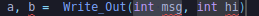
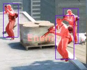
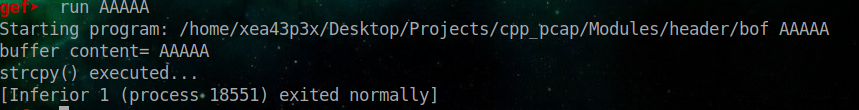
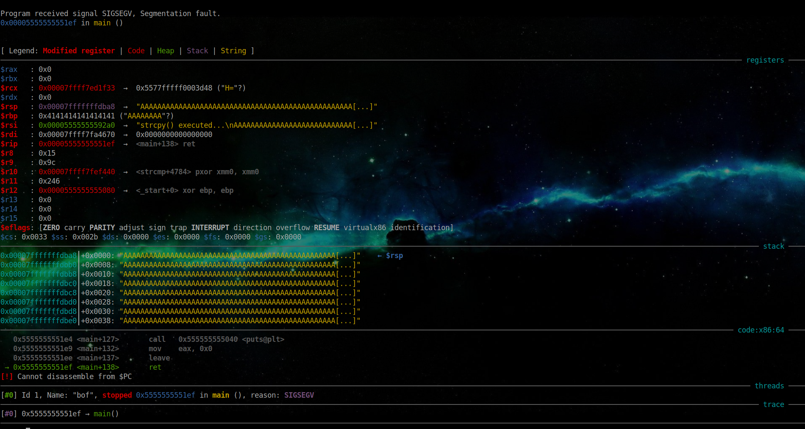
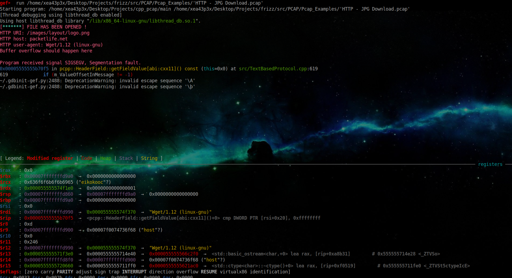
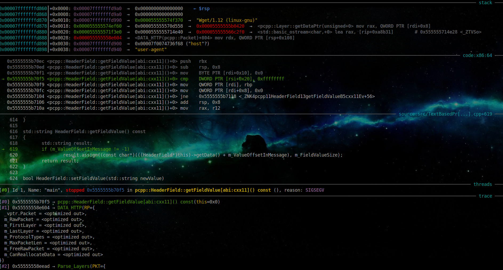
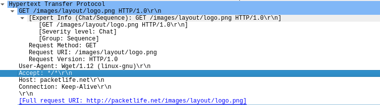
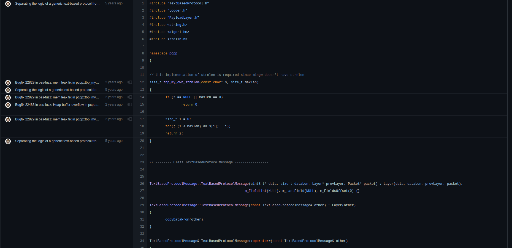
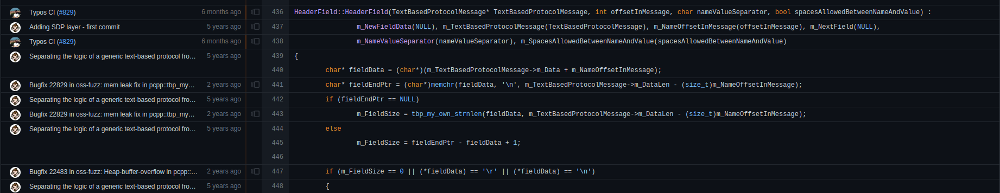

```


_____/\\\\\\\\\\\____________________________________________________________________________________________________________________/\\\\\\\\\_______________________________________         
 ___/\\\/////////\\\_______________________________________________________________________________________________________________/\\\////////________________________________________        
  __\//\\\______\///______________________________________________________________________________________________________________/\\\/________________/\\\__________/\\\_______________       
   ___\////\\\_____________/\\\\\\\\______/\\\\\\\\__/\\\____/\\\__/\\/\\\\\\\______/\\\\\\\\_____________/\\\\\\\\\\\____________/\\\_________________\/\\\_________\/\\\_______________      
    ______\////\\\________/\\\/////\\\___/\\\//////__\/\\\___\/\\\_\/\\\/////\\\___/\\\/////\\\___________\///////////____________\/\\\______________/\\\\\\\\\\\__/\\\\\\\\\\\___________     
     _________\////\\\____/\\\\\\\\\\\___/\\\_________\/\\\___\/\\\_\/\\\___\///___/\\\\\\\\\\\____________________________________\//\\\____________\/////\\\///__\/////\\\///____________    
      __/\\\______\//\\\__\//\\///////___\//\\\________\/\\\___\/\\\_\/\\\_________\//\\///////______________________________________\///\\\______________\/\\\_________\/\\\_______________   
       _\///\\\\\\\\\\\/____\//\\\\\\\\\\__\///\\\\\\\\_\//\\\\\\\\\__\/\\\__________\//\\\\\\\\\\______________________________________\////\\\\\\\\\_____\///__________\///________________  
        ___\///////////_______\//////////_____\////////___\/////////___\///____________\//////////__________________________________________\/////////________________________________________ 


                                                                                            ad8888888888ba
                                                                                           dP'         `"8b,
                                                                                           8  ,aaa,       "Y888a     ,aaaa,     ,aaa,  ,aa,
                                                                                           8  8' `8           "88baadP""""YbaaadP"""YbdP""Yb
                                                                                           8  8   8              """        """      ""    8b
                                                                                           8  8, ,8         ,aaaaaaaaaaaaaaaaaaaaaaaaddddd88P
                                                                                           8  `"""'       ,d8""
                                                                                           Yb,         ,ad8"   
                                                                                            "Y8888888888P"
```

# Article is under development 

Not much here right now, come back later :<

# About this tutorial 

This tutorial was a secondary write up i plan on doing about the C++ programming language. This tutorial will teach the basics to advanced C++ code from using simple variables to data types and using OOP concepts in C++ with the use of public private and friend classes. It will start off like any other introduction where i introduce who i am currently and what my focus of the article is then go into the basics of both security in applications and development as well as the basics of the C++ programming language, NOTE THIS TUTORIAL IS FOR C++ VERSION 20. This tutorial will teach you basic concepts of security as well as making things like encryption scripts, brute forcers, file crawlers, system loaders, authentication systems, key generators, and packet parsers and maybe even IDS's ( Intrusion Detection Systems ). 

The plan for this tutorial is to act again like any other one, it will talk about code bricks and describe them as you move on and on in the project. 


# Whoami 

my name is RE43P3R i am intermediate in cyber security, a game cheat developer, systems / security and authentication systems developer, as well as a legacy developer on my own time. I have had experience in multiple languages those which include 

Language Name  | 
-------------  | 
Fortran95      | 
Fortran77      | 
Fortran2003    |
Perl 3-5       | 
Some RAKU      | 
Ruby           | 
C++            | 
Go             | 

and others that i have yet to do write ups on, if you have not seen my other write ups i have multiple on multiple programming languages currently 

C++, Go, Perl, and general fortran and math

* C++ tutorial                              https://github.com/ArkAngeL43/Advanced-And-Secure-CXX <br>
 
* GO Basics                                 https://github.com/ArkAngeL43/Basics-Of-Go <br>

* GO Advanced Security+                     https://github.com/ArkAngeL43/Go-Cyber-Weapons-Development <br> 

* Fortran Notes                             https://github.com/ArkAngeL43/fortran-notes <br> 

* Perl Cyber weapons                        https://github.com/ArkAngeL43/Perl-basics-and-cyber-weapons-development <br>

* EXIF and Digital Forensics with images    https://github.com/ArkAngeL43/EXIF-Stegonography-and-image-injection <br> 


# Credits and reasons for this tutorial 

Recently i have just gotten a job for Authentication and systems development for a small group of people, and the code and backend of the system will be written in C++20, i have not used C++ at all in a long time which is what prompted the article, at the time of writing this i have so far spent about 4 months in the C++ programming language since a year ago and it has definitely changed alot. i want to thank the writer of the `eighth edition of C++14 and C++17 Coverage Sams teahc yourself C++ in one hour a day` despite us being in C++20 now this book has helped me alot through the proces sof writing this understanding new ways to use and write C++, the very basics of C++ but with a tad touch to it. I highly suggest if you are new to C++ you read that book, it is 700+ pages of pure amazing C++ again if your reading this adn using C++20 it might not be worth the time but it still teaches concepts used in C++.


# NOTICE 

This article is currently under development....


# Application development and a talk about security

In most of these tutorials i always have a say on security, thats because of my experience in the field of development in things such as legacy development, game cheat development, systems and auth development, and so on. Over the year or so i have been programming there is one thing i notice to actually be rare, that being security in applications especially games. The one thing i have always urged people the most during development especially when you are selling people your program or releasing it out to the public to use TO FOCUS ON SECURITY! stop wasting your time with frontend, you're main concern should be the security of an application and how it runs and its functionality. For example, right now i am working with a game called CS:GO and building cheat systems and auth systems for the game cheat application itself, this game cheat toolkit uses external tools things like player highlight and color and such. im actually going to split this talk on security into a small section about game cheating.

> What is an external cheat 

External cheats are simple, they are cheats that are not injected into the game code itself or the vulnerable DLL of the game

> What is an internal cheat 

simply internal cheats are unlike external injected into the vulnerable dll or game or executeable to make code run, with this you can mess with the games functions such as creativity, designs, hit boxes, players etc.

> How does game cheating typically happen 

game cheating is developed or happens when a hacker or developer comes across a vulnerability in the games files, and uses their programming skills to inject code into a process. For example in the game CS:Go you can get character highlight and seeing through walls and even aimbot by simply getting the games PID and memory location, taking memory values themselves for things like POS ( Position ) and injecting it into the memory. Here is an example i found online of a simple ESP (Extra sensory precision) seen below 


<p align="center">
  
</p>

most EXTERNAL cheats such as this very simple ESP is not picked up by AC ( Anti Cheat ), this is because most anti cheat systems are NOT designed to pick it up.

> How do companies and game devs fix these issues 

Typically game developers put what i like to call digital duct tape on the problem. Simply all they do is just install ANTI CHEAT systems like `VAC` to help detect if someone is cheating or not. As said above however Cheats are often not seen or picked up by anti cheat systems if they are external, which means just slapping anti cheat is the most idiotic practice you can go about when trying to fix a vulnerability. Think of that like changing your IP when someone exploits your machine and already has access, it really does not do much but hang people off for a bit until they take 3 hours to think of a better solution to better exploit that program. In this example above you saw a cheat that was external ESP that was able to bypass the VAC system that the developers of CS:GO pulled in to the game to fix an issue that will never be actually fixed. It is of the most IMPORTANT that you make sure applications especially when programming in languages like C++ are constantly CONSTANTLY updated and staying secure and if a vulnerability pops up say a 0-DAY ( A vulnerability a hacker discovers before the developers do ) then you MUST get to fixing it right away if you want to keep you reputation.

# Why c++? 

**Warning: Despite this article relying on mainly research based facts on the C++ programming language, this section may include bias about the c++ programming language, this comes from experience**

C++ is one of those languages that can actually benefit you during the proces sof working with memory, this is also why c++ is a popular choice for alot of DLL based exploitation or is used in memory intense applications. Not to mention that c++ as well is fast in itself. From my personal expereince c++ is a programming that can and cant be used for cyber security. This means that the language like all other 600+ programming languages have the possibility and application to be a programming language for cyber security. However! This does not mean i would choose c++ as a language for any form of cyber security, but given the fact this article will talk about offsensive and defensive cyber security with C++ to the basic and advanced leveles I have decided to steer away from views like that.

# A basic understanding of C++

You can think of c++ as a object orriented and more advanced version of c. C++ to begginers will come very frustrating that is given you do not have the patience to deal with compiler errors which you should have no matter the programming language. The c++ programming language is also despite it being a technical **Compiled** language has Object Oriented Programming or OOP for short. Which also means it uses classes and objects within its code, here is an example of a simple c++ class.

```cpp
#include <iostream>

using namespace std;

class OBJ_CLASS {
     public:
        std::string Data = "Data1";
};
```

C++ has a few ways of implimenting classes in your code, you first use the `class` identifier to let the compiler know that you are initializing a class. Following that we put our class name in this case it is `OBJ_CLASS`, then we declare a keyword named `public:`. C++ has 3 ways of sectioning data within a class 

| Class initation | Use case and definition |
| --------------- | ----------------------- | 
| public:         | All variables, functions, or data within or under this class tag will be considered a public data section. In other words you can access this from another part of the program | 
| private:        | All variables, functions, or data within or under the private class tag are only visible to that class name |
| friend          | Friend tells a given class set say class B that the current class ( class B ) can access variables and functions or other sections of data within say class A, it is used like `friend class A` |

**Using the public variable**

A example usage of the public class tag would look like this 

```cpp 
#include <iostream> 

using namespace std;

class A {
    public: 
         std::string Data = "Data2";
};

int main() {
   A AA;
   std::cout << AA.Data << std::endl;
   return 0;
}
```

so first things first under the public class tag we declare a variable of type `Standard string | std::string` which is named `Data` with a value of `Data2`. this means that any group of data outside of the class can access it, hence in our main function we first define our class name `A` and set it with a access variable which is `AA`. We will use the access variable `AA` to reach all the data within the public sector of the class. Hence `AA.Data`.

Pretty simple right?

**Using the private and public class tags together**

```cpp
#include <iostream>

using namespace std;

class A {
    private:
      std::string Data = "somedata";
    public:
      void Call_Out() {
          std::cout << Data << std::endl;
      }
};

int main() {
   A ClassA;
   ClassA.Call_Out();
   return 0;
}
```

The class above keeps its name `A` but what changes is what we declare within the class, we use a rivate and public class tag telling the class that it has two sections of code. One which is private which will tell the compiler to disallow anything outside of that class to access it, and the other class tag which is public. Under the class tag public we define a void function called Call_Out(). If you are new to C or C++ or really any compiled language you will notice there is something new, that is void functions. Void functions are used in every single interpretted programming language ever, that is most of the time. Void functions are functions that run but do not return any data, In this case our void function will write to the STANDARD OUTPUT our private variable `Data` which can only be seen by that class. In our main block we declare the class name `A` followed by theaccess variable name `ClassA` and we use `ClassA` to call the void function `Call_Out();`

** Using the friend and class keyword**

Believe it or not the friend class tags are pretty easy to understand, its syntax is as follows.

`friend class CLASSNAME;`

In the example below i will define two classes and share variables between them 

```cpp
#include <iostream>
using namespace std;

class A {
   private:
       std::string Data = "D1";
   friend class B;
};

class B {
   public:
      A DT;
      void Passer() {
          std::cout << DT.Data << std::endl;
      }
};

int main() {
  B BCLASS;
  BCLASS.Passer();
}

```

First we define two classes class A and Class B. Class A has a private class tag defined inside of it that holds the variable name `Data` of data type standard string which has a value of `D1`. Again do note that no other class as of right now can see this variable. We then define outside of the private class the friend class tag and tell them to basically become friends with each other. 

`friend class B` 

before we can run our code we need to define class B, class B holds a public class tag which under that class tag has a function that is a void function named `Passer()`. The passer function will not return any data but rather output the private variable from the friend class A to the STANDARD OUTPUT.

In order to print out the data we first need to define class A and assign it to a variable which in our case is `DT` under the void function we call std::cout with the variable `DT.Data`

under our main function we do the same thing 

```cpp
int main() {
    B BCLASS;
    B.Passer();
    return 0;
}
```

Now where exactly do friend classes come in handy? The more advanced you get into C++ you will find the friend class feature very useful, especially if you work with classes and need to share things such as data type structures, variables, or constants together.

# A more basic intro into c++

I know the previous section was a bit advanced for begginers so lets just talk about the flat out basics, after all this tutorial was designed to go from basics to advanced and secure C++.

> Include 

When writing your programs in c++ 100% of the time you will find yourself having to import some lib,header file, or even a standard module within c++. In order to do this we use the word `include`. The include keyword within modern C++20 has a few ways of importing certian files such as .h/.hpp and standard libs such as `stdlib`. Say we want to import the following header file into our code 

**header.h**

```cpp
#pragma once
#include <iostream>


int RUN() {
 std::cout << "Hello" << std::endl;
 return 0;
}
```

Before i go on let me explain this code, its quite simple first we use `#pragma once` which again if you are new to c++ is a keyword we use to prveent the repeat error when we include the same file or header file within multiple other files and .cpp, .hpp or other .h files. Then we include IOStream, IoStrean stands for INPUT OUTPUT STREAM. This is a library we use in c++ to use things such as cout which outputs data or cin which is cinput. Then we declare our function which returns a integer of 0, technically this should be a void function because it does not need to return anything, then we call the `std::cout` function to output the word `Hello`

our main file looks like this 

```cpp
#include "header.h"

int main() {
    RUN();
    return 0;
}
```

we use `#include "header.h"` to include our header file, but wait did we not just use `include <iostream>` what is the difference? Well there are as said above two BASIC ways to include code into c++ with the following symbols, <> and "".

**using <>**

when you use the keyword `#include` + `<somelibname>` you are telling the compiler or rather preprocessor to search for that library within the local C++ directory, in a POSIX sense this would be a filepath such as `/usr/include` or something within the root C++ directory which holds all of the standard libraries. We will only use this if we are importing standard functions, standard files such as `stdlib.h` or we have a library that we include in our root directory.

**using ""** 

When using the include keyword like so `#include "someheader.h"` you are telling the pre processor to look within a certian filepath you have, so say our file `header.h` was in the local directory `Files/Headers/Pre/kit/head/h/header.h` we would use the following line to include that file.

```cpp
#include "Files/Headers/Pre/kit/head/h/header.h"
```

the preprocessor will look within this file path that we specified within our local directory. Ofcourse you can always include filepaths from your include directory but using `""` is more accurate to search for header files within the local directory or other source directories.

# What is the C++ preprocessor

Well what even is a preprocessor? A preprocessor within something such as C/C++ is in a sense a preforms actions prior to compiling the code, and we call this preprocessor by using the `#` symbol which is known as a preprocessor directive. Typically whenever you use the preprocessor directive in C++ you are usually using something such as 

logic like if, else, elif, endif

```cpp
#if
#else
#elif
#endif
```

include 

```cpp
#include
```

define 

```cpp
#define 
```

pragma 

```cpp
#pragma 
```

warnings, errors, or undefinitions 

```cpp
#warning
#error
#undef
```

even macro logic such as 

```cpp
#ifdef
#ifndef
```

These actually really come in handy alot especially if you want to check certian data before the code is fully compiled, or if you want to define errors or error functions etc. In a summary the preprocessor directive is used for when you want the compiler to run certian functions before code is compiled. Typically the preprocessor will run what is known as a preliminary operation. A preliminary operation is an operation ran by the compiler before code can be run such as compiling and mashing header files, parsing preprocessor directives and so on.

# using preprocessor directives

if you are writing code especially in projects which use things such as the windows API or using something such as Dear IMGUI you will most likely find yourself using preprocessor directives. But when exactly or how exactly will you know when to use a preprocessor directive outside of the `#include` statement. 

> define keyword

Lets first talk about the `#define` keyword, using define can sometimes be wacky that is if you do not run it or use it correctly in a perfect format. Like most programming languages it is suggested you use language or base features instead of defining a value that is an integer such as...

```cpp
#define c1 = 1
```

use 

```cpp
std::int c1 = 1;
```

The reason you should use language features such as std::int or std::string over something such as the define directive is mostly because of how honestly obscure some errors and issues you can run into can become. If you do not use the define keyword correctly such as in the use of a function or defining some complex piece of code you can cause a bunch of errors that will confuse you. If you can avoid the define function go for it but if you can not then you just have to make sure your code is accurate. Take this following code example from wikipedia of a demo use using the `#define` keyword.

```cpp
#define ABSOLUTE_VALUE( x ) ( ((x) < 0) ? -(x) : (x) )
...
int x = -1;
while( ABSOLUTE_VALUE( x ) ) {
...
}
```

the person who wrote this code noted the following 

```cpp
/*
It's generally a good idea to use extra parentheses when using complex macros. Notice that in the above example, the variable "x" is always within its own set of parentheses. This way, it will be evaluated in whole, before being compared to 0 or multiplied by -1. Also, the entire macro is surrounded by parentheses, to prevent it from being contaminated by other code. If you're not careful, you run the risk of having the compiler misinterpret your code.

Because of side-effects it is considered a very bad idea to use macro functions as described above.
*/

int x = -10;
int y = ABSOLUTE_VALUE( x++ );
```

you should really only use the define keyword when you absolutely have to, and when you have no other option to do so. When writing C++ code you will often find yourself in a loop of trying to make the code multiplatform which is where the defined keyword might just help you. It will help you during the process of building for other platforms by storing system calls or system data that needs to be specified either at or before runtime.

> Using the error keyword 

the `#error` directive is exactly what it seems like. The error directive will halt or stop the compiler from compiling if it comes across this error to output this messages. This directive is typically used within a function or in a certian brick of code like so.

```cpp
#error ERROR_MESSAGE
```

> The warning directive 

Just like the warning keyword if it is not clear enough if the compiler comes across a warning output so and so warning message, used as so 

```cpp
#warning warning_MESSAGE
```

# Functions and data types 

C++ works really well with functions as well as data types, how you can initialize struct's, integers and longs and even use mathematics as a core component within your programs. All of the time when you are writing a program in c++ you are going to be using a function, it is impossible to run a C++ program without a single function. But lets dive more into it. There are multtiple ways of defining and working with functions like spawning templates to simple void and integer based functions. A basic function by now you should know looks like the code block below.

```cpp
int MATHSTUFF(float x, float y) {
// do math stuff 
return moremathstuff;
}
```

First you declare the data type a function will return or what a function is, then you define its arguments. The arguments each have their own data type unlike languages such as go which do not make this mistake if you are coming from a language like go. If you come from go let me explain, functions in go are written like so 

```go
func MathStuff(float x, y) (float, float) {}//.......
```

where you can make multiple arguments one data type and define the return data type of the function ourside of the arguments of the function and rather put them in `()` after you define the function arguments but before you start the brackets ( in this case ). You can NOT do that in c++, C++ makes you define the functions return type BEFORE the function is written then make you define the argument values with their own data type rather than being apart of one.

Instead of doing 

```go
(float x, y)
```

you have to do 

```c++
(float y, float x) 
```

so the following go function 

```go
func Write_Out(string msg, hi) (string, string) {
     return msg, hi
}
```

would be written in c++ like so 

```cpp
std::string Write_Out(std::string msg, std::string hi) {
    return msg, hi;
}
```

and called like

```cpp
#include "header.h"

int main() {
    std::string a, b;
    a, b = Write_Out("world", "hey");
    std::cout << a << std::endl;
    std::cout << b << std::endl;
    
}
```

if we were to change the values or arguments of the function to a go like style, we would get the following compiler errors 

```
header.h:5:40: error: ‘hi’ has not been declared
    5 | std::string Write_Out(std::string msg, hi) {
      |                                        ^~
header.h: In function ‘std::string Write_Out(std::string, int)’:
header.h:6:17: error: ‘hi’ was not declared in this scope
    6 |     return msg, hi;
      |                 ^~
main.cpp: In function ‘int main()’:
main.cpp:5:31: error: invalid conversion from ‘const char*’ to ‘int’ [-fpermissive]
    5 |     a, b = Write_Out("world", "hey");
      |                               ^~~~~
      |                               |
      |                               const char*
In file included from main.cpp:1:
header.h:5:40: note:   initializing argument 2 of ‘std::string Write_Out(std::string, int)’
    5 | std::string Write_Out(std::string msg, hi) {
      |                       
```

hi is an undeclared variable and does not name a type, it is not implicit or explicit or anything to do with implicit typing so it simply just does not exist which will also cause an error saying that `invalid conversion from const char* to int` because we just tried to name two variables one type but `hi` was not declared or names a type. If you pop open VSCODE and call the function like so 

```cpp
    a, b = Write_Out("world", "hey");
```

you will see when you call the function and auto fill it vscode will automate to 

```cpp
    a, b = Write_Out(int msg, int hi);
```

the autofill for some reason will look like this 



# A small talk on writing C++ code 

Before we hop into the advnaced I want to let you know something, programming C++ anywhere anytime with any operating system is possible. However people often forget that C/C++/C#/Objective-C/F# and other languages like that are VERY VERY specific programming languages. Everything you write could determine a different focus level or type of programming. When using C++ you have to keep in mind that this language has practically changed more than 20 times and has over 5 revisions of the language with a current state of working on a C++23. C++ has many different styles, that is why at the beggining of this tutorial i specified that this tutorial is for C++20 ONLY some of the code we will be writing or you will see will be C++11 but that is just due to the library that we are going to be using but other than this it will be purely c++20.

C++ depending each version the styles change so do the features as well as the security and even the operations. Most of your day to day things such as functions and data types and mathematics stay the same your everyday `pow` and `hypot` functions stay the same but when you start writing more advanced C++ applications the more you will have to write in a specific characterset such as MultiByte or for a specific architecture such as X86 or X64 and for a specific operating system such as Windows or Linux or IOS. Even when you get deeper with C/C++ you will notice when building GUI's you may even need to work with a specific CPU type. All of this matters, despite C++ being a high level language it still has deep ties like any language to the memory and what not. The only difference between something such as python and ruby vs c++ and c is C++ will focus more with memory and its style and features than any other language you might come across in the interpretted language realm.

An example of this is one of the development teams i work on where we develop game exploits for games such as Rust, CSGO and other games amongst that list. These games are written for different operating systems and used advanced libs such as DEAR IMGUI which call depend on the operating system you are on, the way we read and write processes using an OS like API or weather its our own module differs what charset or c++ version we are using. For something like the game cheat below which is a simple ESP using the windows API 



we need to use the multibyte character set as well as use C++20 to fit it with current versions and even regulate the architecture we are compiling for along with the phases such as debug or release or are we using custom linker options and what not. The code you write in C++ along with the style and the functions you use change throughout the versions and it is imparitive you understand what version you are programming for, what app you are using or if you are uisng GCC/G++ or are using using the MSVSC C++ compiler or are you using C++ with a framework like the .NET framework that works along side of C#. Again when you write standard C++ code nothing should really change but it starts to matter when you develop enterprise or corperate level programs and tools or even tools you want people to use on multiple operating systems.

it also may not seem like it and this is worth mentioning but when writing C++ the way you program and use functions will depend on the security of your code, if you are using a deprecated function from a earlier or previous version of C++ you may be actually causing vulnerabilities within your code. Some features from C++ are added and taken away mainly for security purposes, and when people bring those back it just makes their code vulnerable to something wether its PROC/DLL injection or RCE or something like that. Most vulnerabilities within binaries will result in binary exploitation or something along those lines. So the end goal of this talk being to always understand and know exactly what you are doing and what the differences are of the types. This actually brings us into our next segment 

# Writing C++20 with MSVSC 

If you are going to write C++ code especially for something as big as exploitation or application that require constant lookouts and debugs and even good actions, it might be time for you to consider using Microsoft Visual Studio Code IDE (MSVSC). MSVSC has become one of my best friends ever since I restarted C++ development, you have so much oppurtinity to use templates, code loaders, api's and even frameworks such as the .NET framework. When developing C++ you also have a variety of options such as debug or release modes, x86 or x64, linker options such as subsystem faults and even down to characterset customization.

> What is the difference between debug and release?

Remember how i was just talking about how the style depends on your compiler flags and how you run and compile your code using different character sets? Even how when you may write C++ code and have to rewrite it because you have to use a different C++ characterset? Well this is where release and debug come in handy. Debug is basically a option that allows the compiler to log debug information within the compiled files which in the future allows you to be able to debug you're program easy. While release is the complete oposite and actually allows for optimizations to be made to the program. When you write C++ and use different modes (Debug/Release) you will end up having to change your macros and preprocessor definitions or directives differently. A very common mistake people make is creating their code first before configuring your options such as the language version or the linker settings and even the debug or release modes. 

If you do not configure these correctly and say have your options or modes on debug instead of release you can get errors suh as runtime library errors, macro errors, optimizations impacts, and even defined variable errors which if you do not know will cause a bunch of errors during compile time sometimes so large the console can not even take it. A good thing to note about MSVSC is that when you develop or write code you can easily see the errors that are happening during compile / runtime ( if debug ) when you choose to execute your program rather than a million buffer errors which are just chained off the other errors.

> Character sets 

With character sets this really depends, when you are using MSVSC and if you know compiler options you may or may not be using character sets, but why does this matter? If it was not clear enough C++ code can be written a million different ways, now just change up the character set and look at the differences. The way code compiles with a different character set matters because of the way it compiles and runs certian symbols and keywords. For example if you use the WinAPI you will notice if you have a character set not set to something such as multibyte you may not be able to use the WinAPI in some cases due to how the code was written for `not set` characterset based options. Alot of your main code will be changed when it comes to code Macros, if you take something such as the windows API and use alot of the functions in it to build say a GUI and some other functions then switch your character set you will recieve errors from the compiler. Again as noted above it is imperative that you do a deep dive on how this work as this tutorial / article will not take a deep dive into it, but i surely hope you do yourself to understand why and why not you should or should not use a certian character set.

> Summary of this section 

Most of the code we write will be simple until we deep dive into cyber security and other aspects alike. From here on I will be using g++  to compile c++20 code and be running on a linux system again that is until i reach the API section of the program but for now we will not be using that, again when the time comes it will come. To sum up MSVSC is a great tool especially if you do not have a linux system or are more familiar with windows, it makes compiling code, running code, debugging code, setting compile flags and tools and including things such as header files and even source files alot easier and even organizes you're files.

# Using g++ on linux

Before we finally move onto writing more code and getting into a point of advanced code sets and security sets, I would like to touch on G++ and using g++ to your advantage. g++ for those who do not know is like gcc but for c++ its simply just a compiler for linux. There are a bunch of flags you can use that are configured to be specified towards your build such as the following.

> `-o`

if you do not know `-o` is used to specify an output name of the executeable file so you would use this as such 

`g++ main.cpp -o main_exec`

which our compiled code of main.cpp becomes `main_exec.exe/elf/whatever_executeable_format_we_are_building_for`

within this tutorial we will only be using smaller flags rather than jumping into setting enviroment variables and what not since mainly our programs will be consiting of header files or single source.cpp files

# Understanding security in c++

So as you should know there are vulnerabilities out there that exist inside of files weather they occure during or are developed before they still exist. And as explained in the intro they come in all shapes and sizes, anything as small as a DLL injection vulnerability down to BOF ( Buffer Over Flow ). But how exactly do these become say existent? Well most modern day compilers can catch vulnerabilities, MSVSC's compiler will catch code such as the following C++ program.

```cpp
#include <stdio.h>
#include <string.h>
#include <stdlib.h>
 
int main(int argc, char *argv[])
{
 
       // Reserve 5 byte of buffer plus the terminating NULL.
       // should allocate 8 bytes = 2 double words,
       // To overflow, need more than 8 bytes...
       char buffer[5];  // If more than 8 characters input
                        // by user, there will be access
                        // violation, segmentation fault
 
       // a prompt how to execute the program...
       if (argc < 2)
       {
              printf("strcpy() NOT executed....\n");
              printf("Syntax: %s <characters>\n", argv[0]);
              exit(0);
       }
 
       // copy the user input to mybuffer, without any
       // bound checking a secure version is strcpy_s()
       strcpy(buffer, argv[1]);
       printf("buffer content= %s\n", buffer);
 
       // you may want to try strcpy_s()
       printf("strcpy() executed...\n");
 
       return 0;
}
```

this is quite a small BOF example, basically we have a buffer limit which is 5, if the argument count is LESS than two which means we only specified the file without any arguments or our command looks like `./main` when it should look like `./main AAAA`. Then we do NOT check the limit of characters we use a string copy statement which will take the amount of arguments we made or rather the arguments we did make and copy them into the buffer. We go wrong by simply not checking or creating a char limit. Any guess as to what will happen to the program when we run it through GDB with 5 A's? Lets run it through GDB and see this is the output we get from GEF/GDB 



we see that the program runs fine yeah okay thats good, but what exactly happens when we run the program and go OVER the buffer limit which is NOT checked.



woah what the f! whats all of this???? we simply ran the program using the command `run` followed by 139 capital letters which were copied exactly into the buffer using a strcpy statement within C++. When we overflowed that buffer we went over the limit and caused what is known as a buffer overflow. We basically broke passed the allocated memory because we were not able to check this. If we truly wanted to we can program now create ASSEMBLER based shellcode and execute a shell if we were to do more recon on the binary, right now that simply is beyond the scope, later we will be getting into it though! Mostly this will be caught by a compiler typically, in this sense G++ did NOT find an issue but some other compilers may in fact catch issues like that based on templates or common occurences. However you notice how there is a giant line of hex seen here 

`$rbp   : 0x4141414141414141 ("AAAAAAAA"?)`

this is NOT supposed to be there, there should be normal buffers there but there is not, and this is exactly where our buffer overflow landed, and the memory address those A's allocated. Keep this in mind when we get into exploiting BOF on a more secure topic. This will bring us into our next session honestly i did not plan to make this its own section but it became so long that i needed to make it a section.

# Usign GDB/GEF to debug and locate where a vulnerability is comming from 

So in this next case  we have a file which is named pcap.h, inside of pcap.h is a function from the offical c++ packet crafing, parsing, and formatting library `PcapPlusPlus`. Within the function there is data that is outputted when a HTTP layer if found within the packet that is thrown as an argument to the function. The program outputs data such as the HTTP URI, the HTTP host, the HTTP useragent but then before it can output the HTTP cookie there is for some reason a segment violation code that happens, but is it BOF? 

Before we can go on the only way we can really figure this out is by using something known as GDB. GDB stands for GNU Debugger, GDB is a program that is typically used by either code / program engineers or cyber security specialists to scout out a program such as a binary to understand what happens within a program. GDB is used ALOT within the reverse engineering community to reverse engineer or exploit binary files such as the one we are about to do recon on that is vulnerable to BOF. Right now within this section we will be only doing the basics such as running and using programs and scouting them ofc. We are going to run gdb but first things first we need to tell gdb the program or in our case the binary to run, to do this we run the following command.

`gdb ./main`

our main file is the binary filename 

then we need to run it and since our binary requires a filename or pcap filepath we run the following 

`run /home/xea43p3x/Desktop/Projects/frizz/src/PCAP/Pcap_Examples/'HTTP - JPG Download.pcap'`

when we run the file we will get a code from GDB saying that there was a SEGMENT VIOLATION, but why?

BOF vulnerabilities may not just be in simple code forms such as the code example above they me even come in more advanced forms. The following using a PCAPPLUSPLUS library to capture packets. The following program you will see might be a bit hard to understand if you are a begginer but i will explain it. Basically the function i am going to show here is a function that takes a packet and parses the HTTP layer of it using the PcapPlusPlus C++ packet capture and parsing library. The code we get is SIGSEV when we run it through GDB/GEF.

```cpp
void DATA_HTTP(pcpp::Packet RP) {
    	pcpp::HttpRequestLayer* RL = RP.getLayerOfType<pcpp::HttpRequestLayer>();
        if (RL == NULL) {
		    return;
        } else {
            std::cout << "HTTP URI: " << RL->getFirstLine()->getUri() << std::endl;

            std::cout
                << "HTTP host: " << RL->getFieldByName(PCPP_HTTP_HOST_FIELD)->getFieldValue() << std::endl
                << "HTTP user-agent: " << RL->getFieldByName(PCPP_HTTP_USER_AGENT_FIELD)->getFieldValue() << std::endl
                << "Buffer overflow should happen here" << std::endl
                << "HTTP cookie: " << RL->getFieldByName(PCPP_HTTP_COOKIE_FIELD)->getFieldValue() << std::endl;
        }
}
```

first the function is defined as a void function, it simply just does not return any data. Under that we use the `pcpp::HttpRequestLayer* RL = RP.getLayerOfType<pcpp::HttpRequestLayer>();` to assign a variable `RL` to define the request layer of the packet or of the packet. We then check if it is NULL or emptu and if it is we return, if else we continue on to parse the values of the packets HTTP layer that is NOT NULL. we output the URI of the request which if we run the program runs fine which is seen here 

**function**

```cpp
            std::cout << "HTTP URI: " << RL->getFirstLine()->getUri() << std::endl;
```

**OUTPUT**

```cpp
HTTP URI: /images/layout/logo.png\
```

then we go onto print the rest of the data such as the Host, User agent, and the cookie but before we print the cookie we print a message saying 

`Buffer overflow should happen here`

when we run the program we get the following 

```
HTTP URI: /images/layout/logo.png
HTTP host: packetlife.net
HTTP user-agent: Wget/1.12 (linux-gnu)
Buffer overflow should happen here

Program received signal SIGSEGV, Segmentation fault.
```

but where and why is this happening? This code really is not advanced but why?


Under this message is exactly where our BOF will happen, notice how in this program amongst this code below that there is no buffer or strcpy statement?

```cpp
            std::cout << "HTTP URI: " << RL->getFirstLine()->getUri() << std::endl;

            std::cout
                << "HTTP host: " << RL->getFieldByName(PCPP_HTTP_HOST_FIELD)->getFieldValue() << std::endl
                << "HTTP user-agent: " << RL->getFieldByName(PCPP_HTTP_USER_AGENT_FIELD)->getFieldValue() << std::endl
                << "Buffer overflow should happen here" << std::endl
                << "HTTP cookie: " << RL->getFieldByName(PCPP_HTTP_COOKIE_FIELD)->getFieldValue() << std::endl;
```

all this is is just input and output and streams. Where exactly and why exactly is the buffer overflow vulnerability? Lets run it through our good friend GDB and GEF to really understand where the error is happening and why it even exists.

**GDB OUTPUT ( MULTIPLE SCREENSHOTS ) **




In the first image we start our code by using the GDB command 

`run /home/xea43p3x/Desktop/Projects/frizz/src/PCAP/Pcap_Examples/'HTTP - JPG Download.pcap'`

and once we run the program it outputs us this message 

```
Starting program: /home/xea43p3x/Desktop/Projects/cpp_pcap/main /home/xea43p3x/Desktop/Projects/frizz/src/PCAP/Pcap_Examples/'HTTP - JPG Download.pcap'
[Thread debugging using libthread_db enabled]
Using host libthread_db library "/lib/x86_64-linux-gnu/libthread_db.so.1".

HTTP URI: /images/layout/logo.png
HTTP host: packetlife.net
HTTP user-agent: Wget/1.12 (linux-gnu)
Buffer overflow should happen here

Program received signal SIGSEGV, Segmentation fault.
0x00005555555b70f5 in pcpp::HeaderField::getFieldValue[abi:cxx11]() const (this=0x0) at src/TextBasedProtocol.cpp:619
619		if (m_ValueOffsetInMessage != -1)
```

right away nothing but a few miliseconds of running the program we already get errors, we first see the output from the script which is seen here

```
HTTP URI: /images/layout/logo.png
HTTP host: packetlife.net
HTTP user-agent: Wget/1.12 (linux-gnu)
Buffer overflow should happen here
```

and ofc we see the message where we know the buffer overflow vulnerability will happen which happens here 

```
Program received signal SIGSEGV, Segmentation fault.
0x00005555555b70f5 in pcpp::HeaderField::getFieldValue[abi:cxx11]() const (this=0x0) at src/TextBasedProtocol.cpp:619
619		if (m_ValueOffsetInMessage != -1)
```

This time instead of getting a warning or error from GEF saying that it was within our call it is a traceback to a file within the PcapPlusPlus library within the file `TextBasedProtocol.cpp` on line 619. But before we go onto scout exactly why this vulnerability is happening within our code lets look below

GDB throws the error

```
~/.gdbinit-gef.py:2488: DeprecationWarning: invalid escape sequence '\A'
~/.gdbinit-gef.py:2488: DeprecationWarning: invalid escape sequence '\þ'
```

but wait this is comming from the offical `gdbinit-gef.py` file but why did we not get this within our other BOF which was well over a few hundred characters? The most simple conclusion or hypothesis to this would be was the BOF so bad within our program it actually caused errors within GDB either injecting GDB or overflowing into that memory segment which GDB was running the program on? You would think this is a simple python deprecation warning but lets look at the `~/.gdbinit-gef.py` file and go to line 2488.

we have the following python code from line 2478 -> 2497

```python


def read_cstring_from_memory(address, max_length=GEF_MAX_STRING_LENGTH, encoding=None):
    """Return a C-string read from memory."""

    if not encoding:
        encoding = "unicode_escape"

    char_ptr = cached_lookup_type("char").pointer()

    length = min(address|(DEFAULT_PAGE_SIZE-1), max_length+1)
    try:
        res = gdb.Value(address).cast(char_ptr).string(encoding=encoding, length=length).strip()
    except gdb.error:
        res = bytes(read_memory(address, length)).decode("utf-8")

    res = res.split("\x00", 1)[0]
    ustr = res.replace("\n","\\n").replace("\r","\\r").replace("\t","\\t")
    if max_length and len(res) > max_length:
        return "{}[...]".format(ustr[:max_length])

    return ustr
```

so lets look at whats on line 2488 where we were getting the error. On line 2488 it shows the following line below 

```python
        res = gdb.Value(address).cast(char_ptr).string(encoding=encoding, length=length).strip()
```

but wait there is no character here? This is just parsing values, stripping them and running it through an encoding value from a gdb class. So lets really go back to why this traceback was SOOOOOOOO massive, and what went wrong. Clearly GDB was not facing a deprecation error but i still was n ot ready to accept that the hypthesis i made was even close to correct, so i went on. Lets move to wireshark and open this packet and see if maybe something happened when parsing the packet that happened within the program affecting gef, maybe something within the body or even something within the actual packet. Look at the screenshot below which shows wireshark packet analysis on the exact line and the exact first HTTP get request that is found by our C++ program using PcapPlusPlus



Hmmm? It seems as if there is data within the packet but no characters even close to resembling what exactly is going on within GDB, why did GDB error out or not error out but rather give a warning of deprecation?

so that still leaves the possible thought that we may have overflowed so far by parsing the packets within that layer or sections of that packet within that layer so far that we may have just slipped data into a process. This of course could have been GDB but that may be off the table because i can not find a similar error message online.

GDB goes on but sticks to the file, it will dump the hexes and addresses of what and where it went wrong within our code seen here in assembly 

```asm
$rax   : 0x0               
$rbx   : 0x00007fffffffd9a0  →  0x0000000000000000
$rcx   : 0x636f6f6b6f6b6965 ("eikokooc"?)
$rdx   : 0x000055555574f1e0  →  0x0000000000000001
$rsp   : 0x00007fffffffd860  →  0x00007fffffffd9a0  →  0x0000000000000000
$rbp   : 0x00007fffffffd9a0  →  0x0000000000000000
$rsi   : 0x0               
$rdi   : 0x00007fffffffd990  →  0x000055555574f370  →  "Wget/1.12 (linux-gnu)"
$rip   : 0x00005555555b70f5  →  <pcpp::HeaderField::getFieldValue[abi:cxx11]()+0> cmp DWORD PTR [rsi+0x20], 0xffffffff
$r8    : 0xd               
$r9    : 0x00007fffffffd900  →  0x00007f0074736f68 ("host"?)
$r10   : 0x0               
$r11   : 0x246             
$r12   : 0x00007fffffffd990  →  0x000055555574f370  →  "Wget/1.12 (linux-gnu)"
$r13   : 0x000055555571f3e0  →  0x0000555555714e40  →  0x000055555566c2f0  →  <std::basic_ostream<char,+0> lea rax, [rip+0xa8b31]        # 0x555555714e28 <_ZTVSo>
$r14   : 0x00007fffffffd8f0  →  0x00007fffffffd900  →  0x00007f0074736f68 ("host"?)
$r15   : 0x0000555555720660  →  0x0000555555711ff0  →  0x0000555555621ac0  →  <std::ctype<char>::~ctype()+0> lea rax, [rip+0xf0519]        # 0x555555711fe0 <_ZTVSt5ctypeIcE>
$eflags: [zero carry PARITY adjust sign trap INTERRUPT direction overflow RESUME virtualx86 identification]
$cs: 0x0033 $ss: 0x002b $ds: 0x0000 $es: 0x0000 $fs: 0x0000 $gs: 0x0000 
```

Within this section of text we see where data was given such as the host and the useragent represented by the following address 

`0x00007fffffffd990  →  0x000055555574f370  →  "Wget/1.12 (linux-gnu)"`

lets look a bit further down in the stack 

```
0x00007fffffffd860│+0x0000: 0x00007fffffffd9a0  →  0x0000000000000000	 ← $rsp
0x00007fffffffd868│+0x0008: 0x00007fffffffd9a0  →  0x0000000000000000
0x00007fffffffd870│+0x0010: 0x00007fffffffd990  →  0x000055555574f370  →  "Wget/1.12 (linux-gnu)"
0x00007fffffffd878│+0x0018: 0x000055555574ef60  →  0x000055555570d558  →  0x00005555555b0420  →  <pcpp::Layer::getDataPtr(unsigned+0> mov rax, QWORD PTR [rdi+0x8]
0x00007fffffffd880│+0x0020: 0x000055555571f3e0  →  0x0000555555714e40  →  0x000055555566c2f0  →  <std::basic_ostream<char,+0> lea rax, [rip+0xa8b31]        # 0x555555714e28 <_ZTVSo>
0x00007fffffffd888│+0x0028: 0x000055555558e604  →  <DATA_HTTP(pcpp::Packet)+804> mov rdx, QWORD PTR [rsp+0x108]
0x00007fffffffd890│+0x0030: 0x00007fffffffd900  →  0x00007f0074736f68 ("host"?)
0x00007fffffffd898│+0x0038: 0x00007fffffffd940  →  "user-agent"
```

woah! We again see that damn 55555 gex! the one where our code errored out which was represented here 

** ABOVE IN REGISTERS **

```
$rip   : 0x00005555555b70f5  →  <pcpp::HeaderField::getFieldValue[abi:cxx11]()+0> cmp DWORD PTR [rsi+0x20], 0xffffffff
```

**BELOW IN STACK**

```
0x00007fffffffd878│+0x0018: 0x000055555574ef60  →  0x000055555570d558  →  0x00005555555b0420  →  <pcpp::Layer::getDataPtr(unsigned+0> mov rax, QWORD PTR [rdi+0x8]
0x00007fffffffd880│+0x0020: 0x000055555571f3e0  →  0x0000555555714e40  →  0x000055555566c2f0  →  <std::basic_ostream<char,+0> lea rax, [rip+0xa8b31]        # 0x555555714e28 <_ZTVSo>
0x00007fffffffd888│+0x0028: 0x000055555558e604  →  <DATA_HTTP(pcpp::Packet)+804> mov rdx, QWORD PTR [rsp+0x108]
```

it seems like our code is becoming broken or getting close to breaking when we see the 0x00005555571f3e0 register. the debugger goes onto then dumping the data within the code file such as the following 

```cpp
    614	 }
    615	 
    616	 std::string HeaderField::getFieldValue() const
    617	 {
    618	 	std::string result;
 →  619	 	if (m_ValueOffsetInMessage != -1)
    620	 		result.assign((const char*)(((HeaderField*)this)->getData() + m_ValueOffsetInMessage), m_FieldValueSize);
    621	 	return result;
    622	 }
    623	 
    624	 bool HeaderField::setFieldValue(std::string newValue)
```

keep in mind this is directly from the file where GDB found a error, i can assume given the way this is programmed that this is deprecated and may actually be only compiled with a specific style and version of C++. but line 619 as said below 

```
0x00005555555b70f5 in pcpp::HeaderField::getFieldValue[abi:cxx11]() const (this=0x0) at src/TextBasedProtocol.cpp:619
619		if (m_ValueOffsetInMessage != -1)
~/.gdbinit-gef.py:2488: DeprecationWarning: invalid escape sequence '\A'
~/.gdbinit-gef.py:2488: DeprecationWarning: invalid escape sequence '\þ'
```

with address 

`0x00005555555b70f5`

same as seen here within the register dump.

```
$rip   : 0x00005555555b70f5  →  <pcpp::HeaderField::getFieldValue[abi:cxx11]()+0> cmp DWORD PTR [rsi+0x20], 0xffffffff
```

Looking at this we can now find the source of the vulnerability within the source code which in fact is partialy on our part the developers of the script but also the programmers of the library. If we open the file we see the following function 

```cpp
std::string HeaderField::getFieldValue() const
{
	std::string result;
	if (m_ValueOffsetInMessage != -1)
		result.assign((const char*)(((HeaderField*)this)->getData() + m_ValueOffsetInMessage), m_FieldValueSize);
	return result;
}
```

Within this code brick we find a function which is defined as a return type of `std::string` which uses their own class called `HeaderField` to call a function named `getFieldValue()` which ends with the const or constant keyword. Under the brackets we see a variable named result of data type string which is followed by a check. This if statement is standard logic, it checks if the value `m_ValueOffsetInMessage` does not equal -1, and if it does not equal -1 then it assigns the result value like so 

```cpp
result.assign((const char*)(((HeaderField*)this)->getData() + m_ValueOffsetInMessage), m_FieldValueSize);
```

but if else it returns empty, but why should you do this? The developers really are not doing anything but checking if a value is empty, but the reason that this is dangerous is because they are indexing an offset with `-1` typically an offset or value offset that is within a message should never be -1 but if it is instead of returning an empty result there can be more than a million things you can do such as filling that result with `error: value soandsovalue was empty could not grab field data` or something similar and even used more advanced techniques to prevent buffer overflows. So here is something i wanted to do, within this project i wanted to look at the change logs or view the blame file and i can most certianly say my hypthesis of it not being us but rather being a project developer issue is correct using GDB i was able to spot the issue within the file. 

Lets look at the change log to this file / blame 

here is a few screenshots within the blame file, and i want you to really pay attention and read the left side of the commits.




When looking at these commits we can now be almost 100% sure it is a developer mistake infact actually 100% accurate, this sure can be fixed by us the developers simply by making a check to see if the value is empty. But with the way they do this and they operate the code we can not fix it, when i was writing a project using this library it helped alot but i could not get code to work and run well when i kept getting a segmentation fault even when i was checking if the value was NULL and writing advanced functions talking on that. But i actually had to remove the following function completely 

```cpp
		<< "HTTP cookie: " << httpRequestLayer->getFieldByName(PCPP_HTTP_COOKIE_FIELD)->getFieldValue() << std::endl;
```

if you remove this line and run it through GDB you get 

```
gef➤  run /home/xea43p3x/Desktop/Projects/frizz/src/PCAP/Pcap_Examples/'HTTP - JPG Download.pcap'
Starting program: /home/xea43p3x/Desktop/Projects/cpp_pcap/main /home/xea43p3x/Desktop/Projects/frizz/src/PCAP/Pcap_Examples/'HTTP - JPG Download.pcap'

[Thread debugging using libthread_db enabled]
Using host libthread_db library "/lib/x86_64-linux-gnu/libthread_db.so.1".

HTTP URI: /images/layout/logo.png
HTTP host: packetlife.net
HTTP user-agent: Wget/1.12 (linux-gnu)
[Inferior 1 (process 24002) exited normally]
```

Which shows us there might actually be something more going on here, maybe there was an error with the value HTTP cookie, or the way they are parsing this within another function. GDB may show us sometimes if not all the time where a program went wrong especially when working with C++ however it can even go deeper than that. In our case our program is now vulnerable to buffer overflow which within these last two sections is my point. Alot of developers do not scout code enough and it is clear with the amount of times these developers made this project not once did they run it through something such as GDB to debug the program because if they would have they may have been able to prevent the amount of stack overflows, buffer overflows, heap buffer overflows, memory leaks and so on from there. It is imparitive that when you write code as big as this and people widely use it such as a quarter or even a smaller amount of people inside of a community such as the hacking community. Later on in this article i will definitely talk about GDB and exploiting things such as games and files by using GDB as a recopn tool.

> Summary of these two sections 

To sum up these two sections there are a few things i want you to ALWAYS and i mean ALWAYS remember. When writing code in C++ or any language alike it is imperative you understand how important security is not just to you're code base but even in your everyday life. If you release a game cheat or a exploit or malware that will be hosted on someones computer you do NOT want them to see or run something that is vulnerable because someone such as myself or other people who have jobs to tell them to do this kind of thing will exploit your binary or your program EXTREMELY fast. Especially if its obvious that the program is interupting when it should not. The second thing i want you to note is to NEVER trust third party libraries, some ofthem are built by developers and developers make mistakes which is okay its apart of the learning journey but just because it is developed by a popular organization such as google, facebopok or even uber does NOT mean it is safe. Code is often mistaken as something that does not need to be looked after but that is why we have so much vulnerabilities within the systems and services we all use on a day to day life, i seriously encourage you to read again into security on both ends.The last thing to note is to always run your code through something such as GDB/GEF before you publish your code not only does it provide good background knowledge and experience but it can also give you a reason to fix a bug say if a certian function crashes. Or even later as you will see within another section on developing graphical user interfaces with C++ debugging programs that are crashing randomly. GDB and GEF come in handy so much, they really do and despite it being a GNU only thing there are still debuggers out there such as ones built into MSVSC that can help debug and compile your code with or without errors ( sometimes not all the time ).

UPDATE: I did not have enough time or pages to write about the vulnerability so i wrote a medium article on it

https://medium.com/@Totally_Not_A_Haxxer/coming-across-c-bof-buffer-overflow-vulnerabilities-within-libraries-bc8318bb17da


